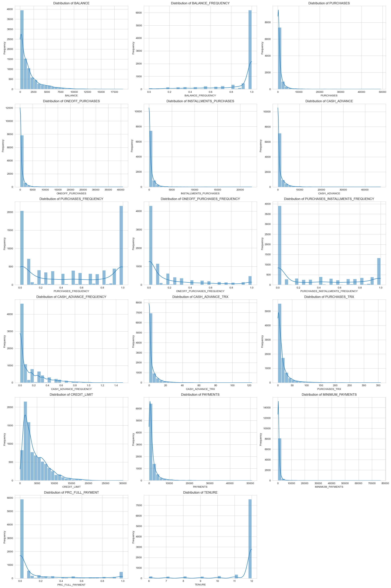
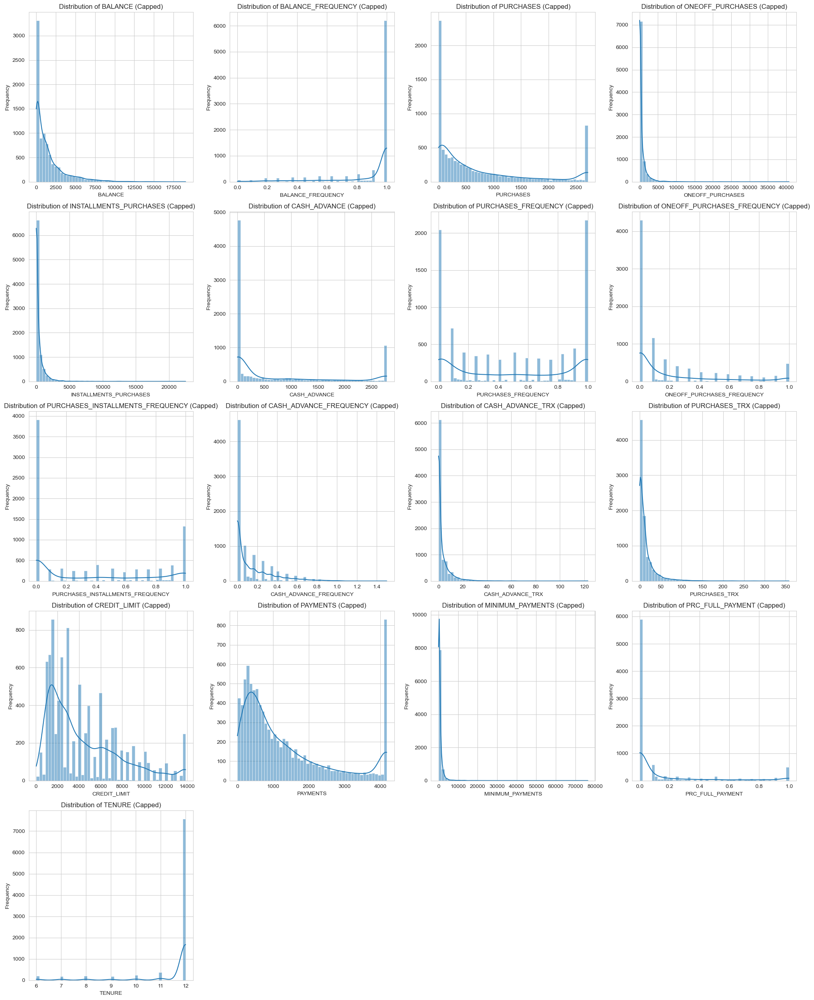
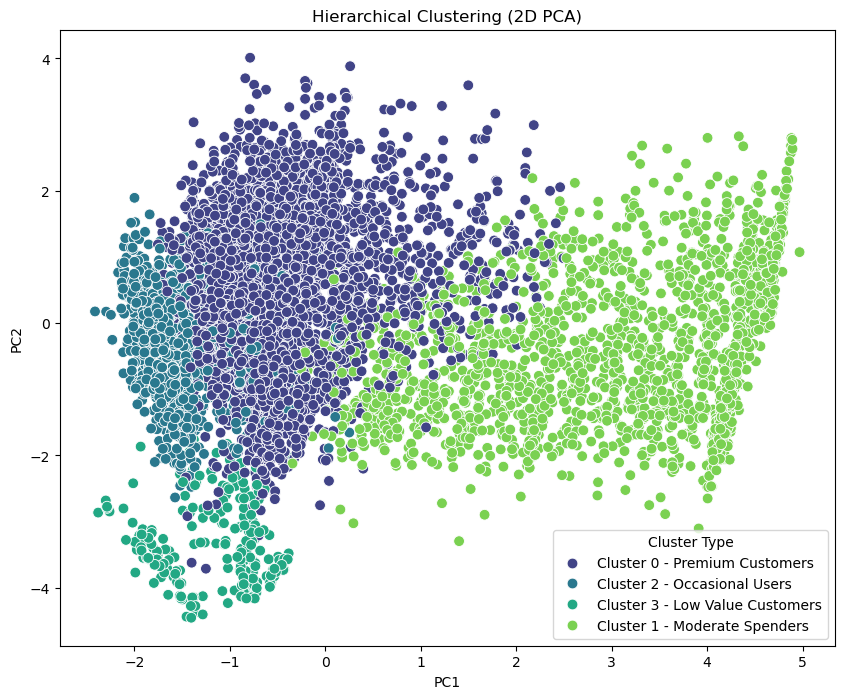
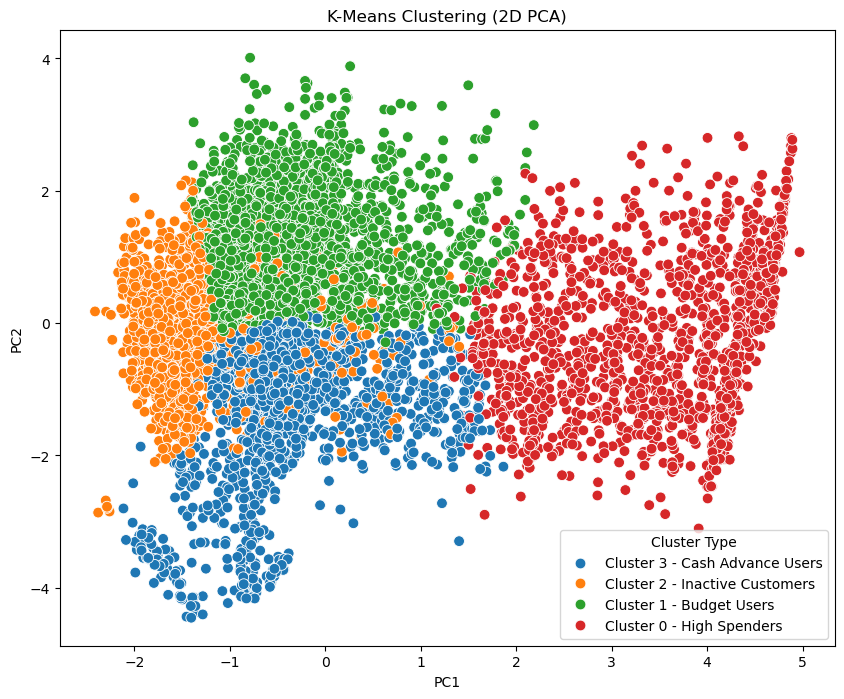
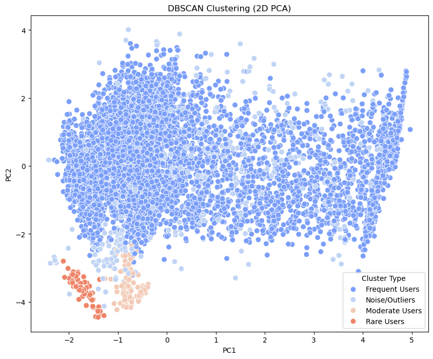

# Streamlit UI
(https://mlopscreditcard-drt2nqzgcls3s6dkc9c5p8.streamlit.app/)
# Credit Card Customer Clustering

This project applies clustering algorithms (KMeans, Hierarchical, and DBSCAN) to credit card customer data to segment customers based on their spending and payment behaviors. The analysis includes data preprocessing, dimensionality reduction, clustering, and evaluation of clustering performance.

## Columns

'CUST_ID',
 'BALANCE',
 'BALANCE_FREQUENCY',
 'PURCHASES',
 'ONEOFF_PURCHASES',
 'INSTALLMENTS_PURCHASES',
 'CASH_ADVANCE',
 'PURCHASES_FREQUENCY',
 'ONEOFF_PURCHASES_FREQUENCY',
 'PURCHASES_INSTALLMENTS_FREQUENCY',
 'CASH_ADVANCE_FREQUENCY',
 'CASH_ADVANCE_TRX',
 'PURCHASES_TRX',
 'CREDIT_LIMIT',
 'PAYMENTS',
 'MINIMUM_PAYMENTS',
 'PRC_FULL_PAYMENT',
 'TENURE'

## Project Structure

```
CC_GENERAL.csv                  # Raw credit card data
CC_GENERAL_preprocessed.csv     # Preprocessed data used for clustering
CODE.ipynb                      # Main notebook: preprocessing, clustering, evaluation, visualization
PREPROCESSING.ipynb             # Data cleaning and preprocessing steps (optional)
VISUALS.ipynb                   # Additional visualizations (optional)
README.md                       # Project documentation
```

## Requirements

- Python 3.7+
- pandas
- numpy
- scikit-learn
- matplotlib
- seaborn
- jupyter

Install dependencies with:
```sh
pip install pandas numpy scikit-learn matplotlib seaborn jupyter
```

## Data

- **CC_GENERAL.csv**: Contains anonymized credit card transactions and customer features.
- **CC_GENERAL_preprocessed.csv**: Cleaned and preprocessed data ready for clustering.

## Workflow

1. **Data Loading & Preprocessing**
   - Load the preprocessed data.
   - Select relevant features.
   - Cap outliers using the IQR method.
   - Scale features using `RobustScaler`.
   - Reduce dimensionality to 2D using PCA for visualization.

2. **Clustering Algorithms**
   - **KMeans**: Partition customers into 4 clusters.
   - **Agglomerative (Hierarchical) Clustering**: Group customers using Ward linkage.
   - **DBSCAN**: Density-based clustering with automatic outlier detection.

3. **Visualization**
   - Plot clusters in 2D PCA space for each algorithm using seaborn and matplotlib.

4. **Evaluation**
   - Compute Silhouette Score, Davies-Bouldin Score, and Calinski-Harabasz Score for each model.
   - Compare clustering performance.

## How to Run

1. Open `CODE.ipynb` in Jupyter Notebook or Visual Studio Code.
2. Run all cells sequentially.
3. Review the visualizations and evaluation metrics at the end of the notebook.

## Example Results

- Visualizations show how customers are grouped in 2D PCA space.
- Evaluation metrics


## OUTPUT

## Before capping

## After capping

## Hierarchical Clustering Visualization (2D PCA)

## KMeans Clustering Visualization

## DBSCAN Clustering Visualization

